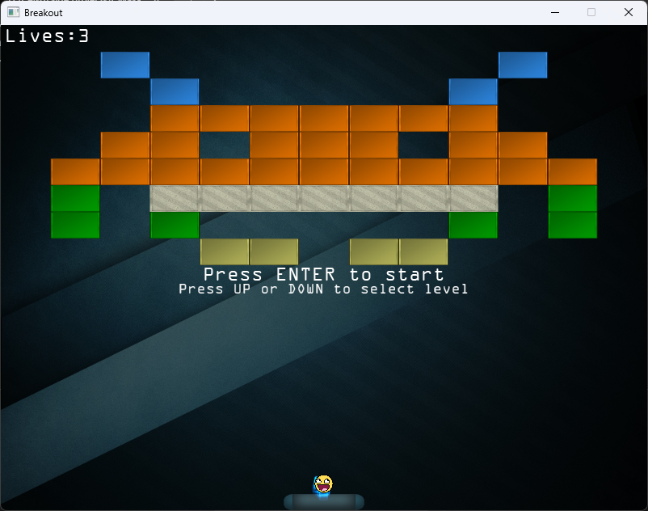

# OpenGL Breakout

<div align="center">
  
</div>

## Installation Requirements
- **Windows**: Install [Scoop](https://scoop.sh/) for managing dependencies
- **Linux**: Not supported
- **macOS**: Not supported

## Installation Requirements
```powershell
scoop install gcc cmake make
```

## Build Instructions

1. Create and enter the `build` directory:
   ```bash
   mkdir build && cd build
   ```

2. Generate the build files:
   ```bash
   cmake -DGLFW_BUILD_EXAMPLES=OFF -DGLFW_BUILD_TESTS=OFF ..
   ```

3. Build the project:
   ```bash
   cmake --build . --config Debug
   ```

4. Run the executable:
   ```powershell
   start .\Debug\OpenGLProject.exe
   ```

5. (Optional) Open the Visual Studio solution if desired:
   ```powershell
   start .\OpenGLProject.sln
   ```

## Gameplay Instructions

- **Level Selection**:
  - Use `Up` or `Down` arrows to navigate levels
  - Press `Enter` to confirm your selection

- **Start the Game**:
  - Press `SPACE` to release the ball

- **In-Game Controls**:
  - Use `Left` or `Right` arrows to move the paddle
  - Hold the left `CTRL` key for a speed boost

## Acknowledgments

This project was built by following the **[LearnOpenGL](https://learnopengl.com)** tutorial by Joey de Vries. It provided invaluable guidance on setting up an OpenGL environment and implementing core game mechanics, shaders, and rendering techniques.

For those interested in learning OpenGL from scratch, this tutorial offers a comprehensive introduction and is highly recommended.
